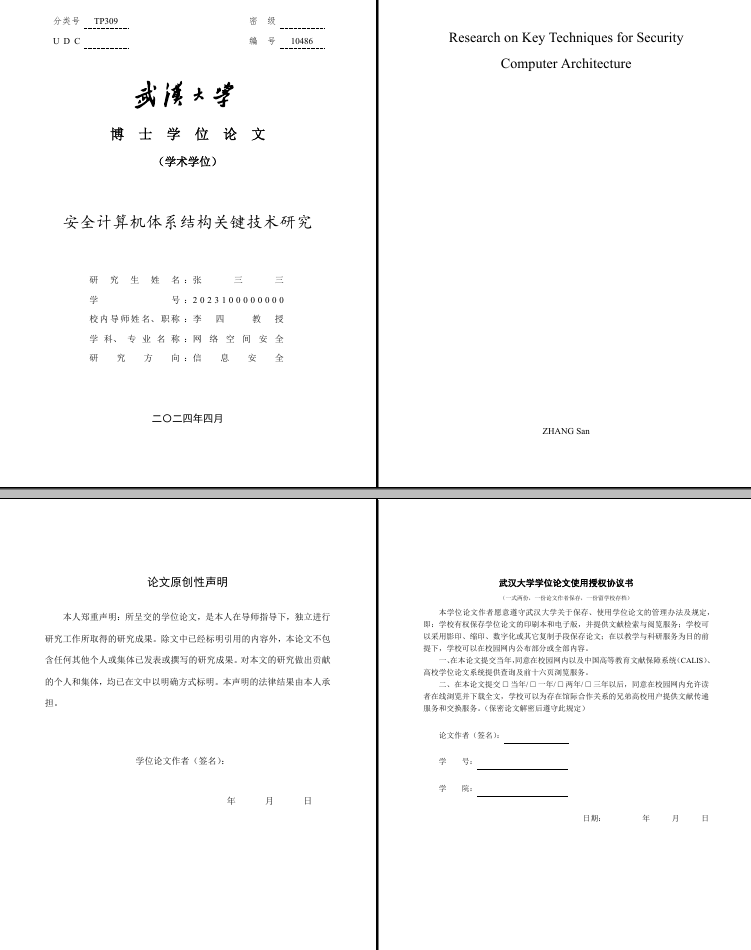
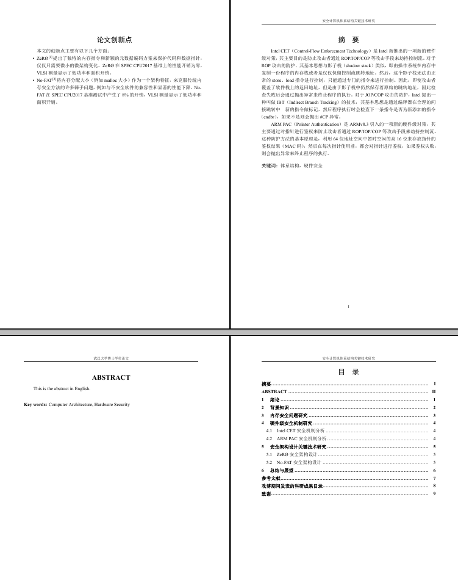
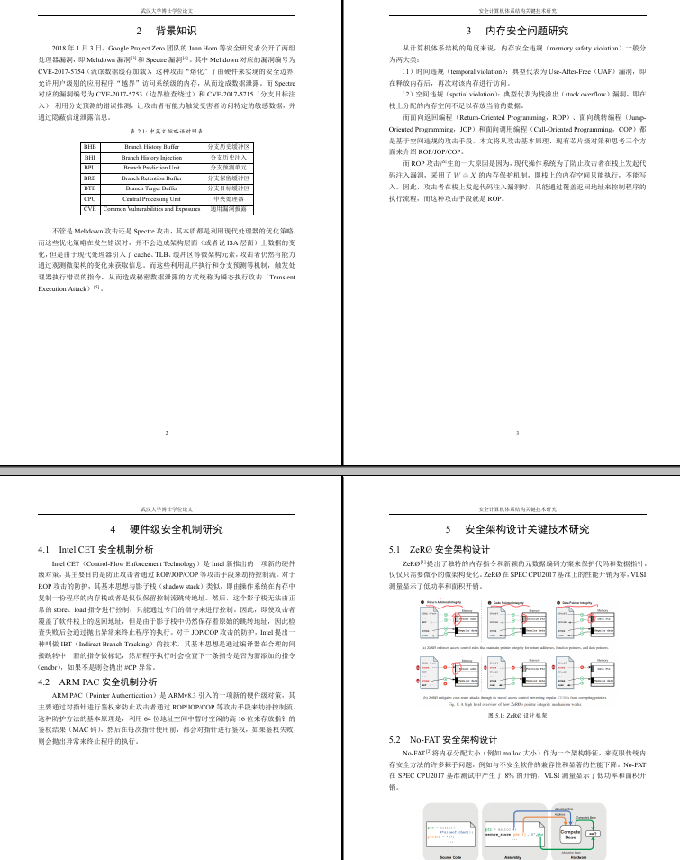

# 武汉大学博士/硕士学位论文Latex模板

## 0x00 模板预览







## 0x01 简要说明

本模板基于黄正华老师的模板制作，主要做出了以下修改：

1. 修正了页眉页脚的设置，使得页眉页脚的位置符合要求；

2. 修正了目录的设置，使得目录的格式符合要求；

3. 修正了参考文献的设置，使得参考文献的格式为国标GBT7714-2015格式，并调整大小写；

4. 修改字体设置，使得章节标题字体符合学校文件《武汉大学博士学位论文撰写及印制规格的规定》的要求，包括：标题字体设置为黑体，正文字体设置为宋体，数字以及英文字体设置为Times New Roman（这些原模板均不满足）；

5. 修改论文封面的上方的下划线为虚线，下方冒号处于“研究生姓名”与名字中间，更接近学校给出的Word模板的格式，不过仍然存在差异；

（2024年4月将模板进一步更新，包含学术学位、专业学位字样，以及下方包含学号等）；

6. 新增插图索引、表格索引；

7. 新增中英文缩略语对照表、主要符号对照表；

8. 调整目录页的页眉，本模板自摘要开始，均包含页眉。

## 0x02 插图与参考文献

插图：

- 插图的位置在`figures/chapter1`、...、`figures/chapter6`中，分别表示第1章至第6章的插图（也可以自行修改）；
- 详见`WHUPhd.cls`文件第254行：

```tex
\graphicspath{{figures/title/}, {figures/chapter1/},
{figures/chapter2/}, {figures/chapter3/},
{figures/chapter4/}, {figures/chapter5/},
{figures/chapter6/}}
```

参考文献：

- 参考文献采用bibtex的方式，每章节对应的参考文献位于`bibs/ref1.bib`至`bibs/ref6.bib`（也可以自行修改）；
- 详见`thesis.tex`文件第152行：

```tex
\bibliography{bibs/ref1}
```

## 0x03 编译方法

本模板使用XeLaTeX进行编译，编译方法为：

`xeLaTeX -> bibtex -> xeLaTeX -> xeLaTeX` 或 `latexmk -xelatex`

## 0x04 论文排版

使用本模板生成的论文排版顺序为：

1. 中文封面

2. 英文封面

3. 论文原创性声明

4. 论文版权使用授权书

5. 论文创新点

6. 中文摘要

7. 英文摘要

8. 目录（间距请自行调整）

9. 插图索引（间距请自行调整）

10. 表格索引（间距请自行调整）

11. 中英文缩略语对照表（间距请自行调整）

12. 主要符号对照表（请自行添加并调整间距）

13. 正文

14. 参考文献

15. 致谢

**提醒：**

- 如果由于本模板的原因，导致排版与学校要求不符，仍然以学校要求为准；
- 因此，为了确保论文排版符合学校要求，建议最好使用学校提供的Word模板进行排版。

## 0x05 问题与联系

如果在使用本模板的过程中遇到问题，可以通过以下方式联系我：

- `GitHub Issues`；
- 邮箱：{wangquancheng@whu.edu.cn}。

## 0x06 致谢

致谢：http://aff.whu.edu.cn/huangzh/
